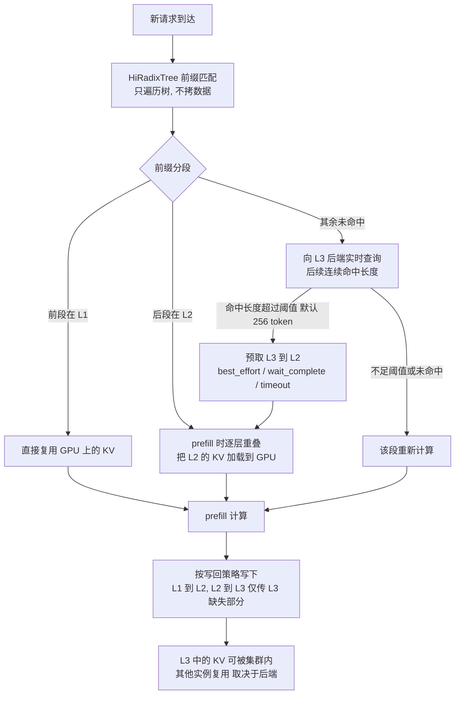

# HiCache：层次化 KV 缓存

> **定位**：SGLang 在 RadixAttention（GPU 显存内的前缀 KV 复用）之上加的**存储层级**：把 KV 缓存从 GPU 显存扩展到主机内存和分布式存储，用"CPU 三级缓存"的思路换更大的可复用容量。
> **研究线**：三级各存什么、什么时候往下写（写回策略）、什么时候往上取（预取策略与触发条件）、这些层级如何挂在同一棵前缀树 HiRadixTree 上。
> **划界**：不是 PD 分离（那是 prefill / decode 算力如何分池，见 [[PrefillDecode分离与统一服务]]）；不是 API 层的 Prompt Cache 与计费 TTL（见 [[Prompt前缀缓存]]）；不做引擎横向选型（见 [[推理引擎生态]]）；不涉及 KV 本身的量化压缩（见 [[KV缓存量化与压缩]]）。

---

## 一、材料

| 角色 | 标题 | 作者 / 机构 | 日期 | 链接 |
|---|---|---|---|---|
| 主锚 | *SGLang HiCache: Fast Hierarchical KV Caching with Your Favorite Storage Backends* | Zhiqiang Xie / LMSYS Org（SGLang 团队） | 2025-09-10 | https://www.lmsys.org/blog/2025-09-10-sglang-hicache/ |
| 设计文档 | *HiCache System Design and Optimization* | SGLang 官方文档 | 持续更新的文档页，页面无发布日期；按 2026-09-28 (CST) 所见版本引用 | https://docs.sglang.ai/advanced_features/hicache_design.html |
| 辅助佐证 | *SGLang HiCache x Mooncake Store Performance* | Mooncake Team | 页面无发布日期；按 2026-09-28 (CST) 所见版本引用 | https://kvcache-ai.github.io/Mooncake/performance/sglang/sglang-hicache-benchmark-results-v1.html |

说明：博客讲动机与总体设计，文档给出工作流、触发阈值、策略定义和参数；两者冲突时以文档的具体定义为准。Mooncake 页只用来佐证"L2 容量耗尽后 L3 保住命中率"这一点。

---

## 二、为什么要分层

- **前缀复用的收益被显存容量卡住**。RadixAttention 在 GPU 显存里缓存并复用前缀 KV；但上下文越长、客户端越多、对话轮数越多，历史 KV 就越多地被驱逐来给新数据腾地方，命中率随之下降（博客 "Why Hierarchical KV Caching Matters"）。
- **未命中就得重算 prefill**。博客引用的社区案例：Novita AI 的编码 agent 场景（Qwen3-Coder-480B）对话常超过 25K token、每会话约 8 轮，不保留完整 KV 时几乎每个请求都要重算；接入 HiCache + DeepSeek 3FS 后，命中率从 40% 升到 80%，会话平均 TTFT 降 56%。
- **思路**：借鉴 CPU 的三级缓存，GPU 显存当 L1、主机内存当 L2、分布式存储当 L3，把 GPU 和 CPU 上"闲置"的空间都用上，再接入 Mooncake、3FS、NIXL、AIBrix KVCache 等做全局 KV 存储（文档 "Why and What is HiCache?"）。

一句话：**显存装不下的历史 KV，不丢，往下放；下一次同前缀请求来了，再往上取，而不是重算。**

---

## 三、三级缓存对照表

先说白话：

- **L1 = GPU 显存**：正在算的和最热的 KV，布局照顾计算内核。
- **L2 = 本实例的主机内存**：L1 放不下的历史 KV，靠高带宽 CPU–GPU 链路随时拉回；**只属于一个推理实例**，同机其他实例也看不到。
- **L3 = 存储后端**：容量最大、可在集群内共享（取决于后端配置），但延迟高且不稳定，所以要"提前取"。

| 层级 | 介质 | 共享范围 | 存什么 | 写入时机 | 读取 / 预取时机 | 主要代价 |
|---|---|---|---|---|---|---|
| **L1** | GPU 显存（HBM） | 单个推理实例私有 | 当前计算需要的 KV 与热前缀；layer-first 布局，兼容计算内核 | prefill 计算直接产生 | 前缀树匹配命中即直接用，无拷贝 | 容量最小，是整个问题的起点 |
| **L2** | 主机内存（CPU DRAM） | 单实例、单节点私有；多台机器的主机内存**不能**拼成一个更大的 L2 | 从 L1 写回的 KV；可改用 page-first 等 I/O 友好布局 | 按写回策略从 L1 写下（见第四节） | 前缀树匹配命中 L2 段时，prefill 中逐层重叠加载到 GPU | 需要 CPU–GPU 传输；布局与 GPU 不同需重排 |
| **L3** | 存储后端：file、mooncake、hf3fs（3FS）、nixl、aibrix 或自定义 | 由后端配置决定；分布式后端且各实例指向同一命名空间时才是集群级共享 | 从 L2 写下的 KV，按页存储；跨实例复用只能靠这一层 | 从 L2 写下时只传 L3 **尚不存在**的数据 | L1/L2 未命中部分向 L3 查询，连续命中超过阈值（默认 256 token）触发预取到 L2 | 延迟显著更高且难预测；元数据不在本机缓存，需实时查询后端 |

两处容易误解的点（均出自文档 "Tier Sharing Scope"）：

1. 实例 0 产生的 KV，**只有到达 L3 之后**实例 1 才看得到。
2. 调大 `--hicache-ratio` / `--hicache-size` 只是放大各实例自己的 L2；要跨实例复用，必须配 `--hicache-storage-backend`。

---

## 四、写回与预取：两个方向的策略

### 4.1 往下写（快层 → 慢层）

文档 "Data Write-back" 定义三种写回策略（开关 `--hicache-write-policy`）：

| 策略 | 什么时候写到下一层 | 适用 |
|---|---|---|
| `write_through` | 每次访问都立即写到下一层 | 带宽充足时缓存收益最强 |
| `write_through_selective` | 访问次数超过阈值（命中计数追踪）才写，只备份热点 | 想减少 I/O 负载 |
| `write_back` | 只有在上层驱逐这块数据时才写到下一层 | 慢层容量也吃紧、要最大化内存利用时 |

补充规则：

- 写回时机的总体口径是 **prefill 计算完成后**，系统再考虑把新生成的 KV 存入 L2 或 L3（文档 "Overall Workflow"）。
- **L2 → L3 去重**：只传 L3 中还没有的数据（文档 "Cross-instance Sharing"）。
- **MLA 模型的写回优化**：MHA 在多 TP 下每个 rank 只持有 1/tp_size 的 KV；MLA 下各 rank 持有完整且相同的 KV，因此只让一个 rank 发起写回，避免重复存储（文档 "Data Transfer Optimization"）。

### 4.2 往上取（慢层 → 快层）

两段上行路径处理方式不同，原因是延迟特性不同（博客 "Versatile control plane"）：

- **L2 → L1：逐层重叠加载**。CPU–GPU 带宽通常较高，prefill 时计算第 N 层的同时加载第 N+1 层的 KV，把传输藏在计算后面。
- **L3 → L2：机会式预取**。存储延迟往往高得多且难预测，所以在 L3 探测到命中后，由缓存控制器提前把数据取进主机内存。

**预取触发条件**：本机匹配结束后，对 L1/L2 未命中的部分向 L3 查询后续连续命中的元数据；L3 命中长度**超过阈值（默认 256 token，可配置）**才触发预取（文档 "Prefetch from L3"）。

**预取何时停**（开关 `--hicache-storage-prefetch-policy`）：

| 策略 | 停止条件 | 取舍 |
|---|---|---|
| `best_effort` | GPU 一旦可以开始 prefill 就立即终止，不等待 | 对延迟极敏感 |
| `wait_complete` | 必须等全部预取完成 | 追求高命中率 |
| `timeout` | 超时或完成即停 | 平衡延迟与命中率；文档推荐用于生产，便于满足 SLO |

预取停下后，已取到的数据与本机已有数据一起参与 prefill。`timeout` 的超时时间随待取 token 数线性增长并有上限：

```
timeout = min(prefetch_timeout_max,
              prefetch_timeout_base + prefetch_timeout_per_ki_token * num_token_to_fetch / 1024)
```

默认值：base 2 秒、每 1024 token 0.1 秒、上限 30 秒（文档原文）。

---

## 五、与 Radix 前缀树的衔接：HiRadixTree

- RadixAttention 的 RadixTree 中，每个节点对应一段连续 token 在 GPU 显存中的 KV；根到叶的路径就是一个请求的前缀，共享前缀的请求复用同一批节点。
- **HiRadixTree** 沿用这一结构，但每个节点额外记录这段 KV **在哪一层**：GPU、CPU、L3，或同时在多层。博客称它相当于一张"页表"。
- 元数据的精度分层：L1/L2 的数据，树里保存精确地址；**L3 的元数据不存也不持续同步**，访问时实时询问后端（是否存在、在哪台服务器哪个位置），以降低开销。
- **匹配规则**：从根向下按前缀逐节点比对；`page_size > 1` 时按页粒度匹配；若匹配终止在某节点内部，会自动分裂该节点形成精确边界。匹配只遍历树、不拷数据，所以很快；返回一个连续前缀，**前段在 L1、后段在 L2**（文档 "Local Match"）。

所以三级缓存并没有另起一套索引：**前缀树仍是唯一入口，节点上多了一个"住在哪一层"的标记**，L3 则只在需要时再问。

---

## 六、完整数据流



编号版本：

1. **匹配**：在 HiRadixTree 上找最长前缀，得到"L1 段 + L2 段"。
2. **查 L3**：剩余部分向 L3 查询连续命中长度；超过阈值则发起预取到 L2。
3. **收口**：按预取策略决定等多久；停下后，已取到的部分与 L1/L2 数据合并。
4. **上载**：L2 中的 KV 在 prefill 中与计算逐层重叠地加载到 GPU；预取不到的部分重算。
5. **写回**：prefill 完成后，按 `write_through` / `write_through_selective` / `write_back` 把 KV 写到 L2、L3。
6. **驱逐**：L1 空间不足时驱逐旧 KV；在 `write_back` 下，驱逐正是写到下一层的时机。材料没有展开驱逐的具体算法。

多卡（如 TP）时，各 rank 的判断必须一致：预取前用 `all_reduce(op=min)` 统一 L3 命中数（避免各 rank 对是否过阈值判断不一），预取结束后再用一次 `all_reduce(op=min)` 统一成功取回的前缀长度（文档 "Multi-Rank Synchronization"）。

---

## 七、关键设计点

### 7.1 数据面：布局与传输内核

- **GPU 布局不动、L2/L3 改布局**。GPU 内存池保持 layer-first，兼容计算内核；其他层改用 page-first，同一页的全部 KV 放在连续内存里，单次事务传得更大；博客称这一布局结合零拷贝，使主机内存与存储层之间的传输在典型部署下吞吐最高提升 2×。
- **page-first 的副作用与 page_first_direct**。GPU 按层计算，page-first 数据从 L2 传回 GPU 时只能以"每层一个 token"为粒度；`page_first_direct` 把同一页内同一层的所有 token 放在一起，使 L2→GPU 传输可按"页-层"聚合（文档 "Data Transfer Optimization"）。
- **GPU 辅助 I/O 内核**。在 `cudaMemcpyAsync` 之外实现了专为 KV 传输优化的 CPU–GPU 内核，传输吞吐最高提升 3×（博客与文档一致）。
- **零拷贝**。L2 到 L3 传输时直接传内存地址和长度。
- **页大小的取舍**。`--page-size` 越大，元数据开销越小、存储 I/O 越高效，但部分匹配一页时命中率可能下降；长公共前缀负载适合大页，前缀多样的负载适合小页（文档参数说明）。

### 7.2 控制面：后端接口

- 后端只需实现三个操作：`get(key)`、`exist(key)`、`set(key, value)`；调度与同步由中心缓存控制器负责（博客）。文档中对应抽象类为 `HiCacheStorage(ABC)`。
- 已接入的 L3 后端：Mooncake（RDMA、多网卡零拷贝）、DeepSeek 3FS、NIXL（统一访问 3FS、GPU Direct Storage、S3 兼容对象存储等插件）、AIBrix KVCache，以及演示用的 HiCacheFile；LMCache 作为 HiCache 的替代方案存在（文档）。

### 7.3 与 PD 分离的衔接

- SGLang 的 PD 分离经 Mooncake TransferEngine 实现；HiCache 可同时在 prefill 节点和 decode 节点启用，以优化 prefill 性能。**在 decode 节点启用时，decode 输出也会写回 L3**（文档 "Integration with PD-Disaggregation Deployment Mode"）。
- 博客写明 HiCache 与 PD 分离的协同设计仍在进行中。社区案例中，蚂蚁集团在 PD 分离部署下测 DeepSeek-R1-671B，缓存命中相对完全重算平均降低 84% TTFT（博客引用）。

### 7.4 效果（只取原文数字）

- 博客自测：长上下文和多轮对话基准上，吞吐最高提升 6×、TTFT 最高降低 80%。
- Mooncake 基准页佐证分层的意义：多轮对话前三轮，+L2 与 +Mooncake 命中率相同，+L2 因无需远端取数略快；轮数增加、KV 超出 L2 容量后，+L2 命中率逐步下降、TTFT 明显上升，而 Mooncake 保持高命中率，TTFT 增长很慢。

---

## 八、划界

HiCache 回答的是"**KV 放在哪一层、何时上下移动**"。[[PrefillDecode分离与统一服务]] 回答"prefill / decode 算力是否分池"，两者是不同维度，可以叠加（见 7.3）；[[Prompt前缀缓存]] 讲模块化 Prompt Cache 与商业 API 的写入 / 读取 / TTL 计费结构，不涉及引擎内的存储分层；引擎之间怎么选看 [[推理引擎生态]]，本篇不做对比。

---

## 九、小结

- **本质**：把 RadixAttention 的前缀复用从"只在显存里"扩展成 GPU（L1）/ 主机内存（L2）/ 分布式存储（L3）三级，用容量换命中率，用命中率换更少的 prefill 重算。
- **索引**：前缀树仍是唯一入口；HiRadixTree 节点标记所在层级，L1/L2 存精确地址，L3 实时查询。
- **往下写**：`write_through`（最强收益）/ `write_through_selective`（只备份热点）/ `write_back`（驱逐时才写）；L2→L3 只传缺失部分。
- **往上取**：L2→L1 逐层重叠加载；L3→L2 在命中超过阈值（默认 256 token）时预取，按 `best_effort` / `wait_complete` / `timeout` 决定何时停。
- **共享边界**：L1、L2 实例私有；跨实例复用只能靠 L3，且取决于后端配置。
- **工程关键**：GPU 保持 layer-first、其余层用 page-first；GPU 辅助 I/O 内核与零拷贝；后端只需实现 get / exist / set 三个接口。
