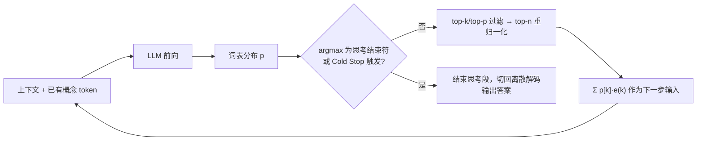

# Soft Thinking：连续概念空间推理

> **定位**：Soft Thinking（Zhang et al., arXiv:2505.15778v1）是一种**不改权重、不训练**的推理期解码方法：在 `<think>` 思考段内，模型每一步不再"选定一个词"喂回自己，而是把整张下一词概率分布对应的**概率加权 embedding**（论文称 *concept token*，概念 token）喂回去；思考结束后再切回普通离散解码输出答案。
> **研究线**：概念 token 怎么构造、怎么喂回、何时停止（结束符判定 + Cold Stop）；与离散 CoT、[[潜空间推理Coconut]] 的机制差。
> **划界**：训练式潜推理见 [[潜空间推理Coconut]]；语言空间 CoT / 采样 / 搜索通史见 [[推理时扩展TestTimeScaling]]；按难度分配 token 与样本预算见 [[自适应测试时算力]]。
> **时间窗说明**：主文 v1 发表于 **2025-05**（2025-05-21 UTC），早于本库近一年关注窗口（约 2025-09 至 2026-09）。仍予收录，原因有二：它是**训练免费连续推理**的代表做法；并且它以推理引擎开关的形式落地——原文附录 A.3 把它实现为 SGLang v0.4.6.post1 的一个推理模式（配置项 `enable_soft_thinking` 等），官方仓库以 `--enable_soft_thinking` 命令行参数开启，仓库页将其标注为 NeurIPS 2025 论文的官方实现。

---

## 一、材料

| 材料 | 作者 / 版本 / 日期 | 链接 | 角色 |
|---|---|---|---|
| **主文** *Soft Thinking: Unlocking the Reasoning Potential of LLMs in Continuous Concept Space* | Zhen Zhang, Xuehai He, Weixiang Yan, Ao Shen, Chenyang Zhao, Shuohang Wang, Yelong Shen, Xin Eric Wang（UCSB、UCSC、UCLA、Purdue、LMSYS、Microsoft）；arXiv **2505.15778v1** \[cs.CL\]，2025-05-21 17:29 UTC（CST 2025-05-22 01:29）；16 页（含附录） | https://arxiv.org/abs/2505.15778 · https://arxiv.org/pdf/2505.15778 | 一手：定义、Cold Stop、线性化分析、主表、消融、SGLang 实现 |
| **官方仓库** eric-ai-lab/Soft-Thinking | 基于 SGLang 0.4.6.post1 的修改版 | https://github.com/eric-ai-lab/Soft-Thinking | 复现入口；推理参数与小模型提示 |
| **对照** *SoftCoT: Soft Chain-of-Thought for Efficient Reasoning with LLMs* | Yige Xu, Xu Guo, Zhiwei Zeng, Chunyan Miao（NTU）；arXiv 2502.12134v2（2025-05-27 UTC），ACL 2025 main | https://arxiv.org/abs/2502.12134 | 仅一句对照 |

---

## 二、白话：离散 CoT 每一步都在"扔信息"

标准 CoT 在每个思考步骤里，模型先算出词表上的一整张概率分布，然后**只取一个词**（采样或 argmax），把这个词的 embedding 喂回下一步。分布里其余候选——比如"先乘 4"和"先乘 30"各占四成——在这一刻就被丢掉了。一旦选错分支，后面只能沿错路走下去，或者花更多 token 绕回来。

原文把这点概括为两层限制（§1）：

1. **表达受限**：每步输入只能是词表里某个词的 embedding，也就是语义空间中的一个固定点；
2. **单线承诺**：每步只采一个 token，就是只押一条推理分支；在不确定性高、合理路径多的题目上，容易走偏或浪费 token。

Soft Thinking 的想法很直接：**先不做选择，把整张分布"揉"成一个向量喂回去**，让下一步同时看到几个候选的混合，等模型自己变得确定时再落回具体的词。

---

## 三、机制

### 3.1 概念 token 与连续概念空间（§3.2）

记词表为 $V$，embedding 矩阵为 $E\in\mathbb{R}^{|V|\times d}$，第 $k$ 个词的 embedding 为 $e(k)=E[k]$。

- **概念 token（Definition 1）**：思考段某一步模型给出的词表分布 $p\in\Delta^{|V|-1}$，直接定义为概念 token $ct:=p$。它不塌缩成单个 token id，而是保留下一步的全部可能。
- **连续概念空间（Definition 2）**：所有词 embedding 的凸组合
$$
\mathcal{C}=\Big\{\textstyle\sum_{k=1}^{|V|}\alpha_k\,e(k)\;:\;\alpha\in\Delta^{|V|-1}\Big\}\subset\mathbb{R}^d .
$$
原文强调它不同于通常意义上的 $d$ 维实向量语义空间：它只是输入 embedding 张成的"凸包"，因此始终落在模型熟悉的输入空间附近。

### 3.2 如何喂回模型（式 5 与复杂度分析）

下一步的输入 embedding 是概率加权和：
$$
\tilde e_{\text{next}}=\sum_{k=1}^{|V|} ct[k]\,e(k)=\sum_{k=1}^{|V|} p[k]\,e(k)\in\mathcal{C}.
$$

工程上并不真的对全词表求和。原文复杂度分析的做法是：先对分布做 top-k / top-p 过滤去掉低概率噪声，再取概率最高的 top-$n$ 个 token、重新归一化，最后只对这 $n$ 个 embedding 做一次加权求和，每步开销 $O(n\cdot d)$。实验中 $n$ 在 $\{5,10,15,20,30\}$ 中搜索，QwQ-32B 取 15 最好，DeepSeek-R1 蒸馏模型取 10（§4.2）。思考段之外的一切不变：答案段的 token 仍按普通方式离散采样。

**可读性从哪来**：原文展示思考过程时，是在每一步取概率最高的 token 拼成文本（Figure 3、Figure 4）。例如 "43 × 34" 一题，这样拼出的 Soft Thinking 轨迹为 96 token，标准 CoT 为 157 token，二者都得到 1,462。Figure 4 还显示：措辞和规划类位置（如第 1–3 步）分布较平，计算数字的位置接近 one-hot；第 36–37 步模型在"乘 4"与"乘 30"之间权衡，更偏向 4，随后第 42 步选择先乘 4。需要注意，这份"可读文本"只是每步 argmax 的投影，模型实际消费的是混合向量。

### 3.3 停止机制：两条规则，一个动机

1. **结束符判定（§3.2）**：若某个概念 token 的最高概率项是思考结束符 `</think>`，思考段结束，切到答案模式。
2. **Cold Stop（§3.2）**：模型从未见过概念 token 这种输入，思考段拉得太长时会进入分布外（OOD）状态，出现重复直至撞上最大长度的"生成崩塌"。Cold Stop 每步计算概念 token 的熵
$$
H(p)=-\sum_{k}p[k]\log p[k],
$$
给定熵阈值 $\tau$ 和连续步数 $k$：若 $H(p)<\tau$ 则低熵计数器加一，否则清零；计数达到 $k$ 时**强行插入** `</think>`，转入答案生成。低熵即"冷"，表示模型已足够确定，可以收尾。实验中 $\tau\in\{0.01,0.05,0.1,0.2\}$，$k\in\{128,256,512,1024\}$，按最优组合报告（§4.2）。熵计算为 $O(|V|)$，相对一次前向可忽略。

所以 Cold Stop 的首要动机是**防 OOD 崩塌**，省 token 是附带收益，并不是一个按难度分配预算的控制器。

### 3.4 为什么可能有效：路径求和的线性化（§3.3）

答案概率本应对所有中间推理路径求和：
$$
p(y\mid x)=\sum_{t_1}p(t_1\mid x)\sum_{t_2}p(t_2\mid x,t_1)\cdots\sum_{t_m}p(t_m\mid x,t_{1:m-1})\,p(y\mid x,t_{1:m}),
$$
路径数随长度指数增长。把 $t_1$ 视为 one-hot 向量，其期望正是第一个概念 token $ct_1=p(\cdot\mid x)$；在均值处对 $p(y\mid x,\cdot)$ 做线性近似，外层求和就换成一次评估 $p(y\mid x,ct_1)$。逐层递归，得到
$$
p(y\mid x)\approx p(y\mid x,ct_1,ct_2,\ldots,ct_m).
$$
离散 CoT 则是用"采一个 token"代替每层求和，丢掉了其他路径的概率质量。这是一个**启发式论证**：它依赖逐层线性近似，原文没有给出误差界。

---

## 四、三种"思考输入"对照

| 维度 | 离散 token CoT | Soft Thinking（概念混合） | Coconut（潜向量） |
|---|---|---|---|
| **每步输入** | 采样或 argmax 所得**单个 token** 的 embedding | 词表分布 top-$n$ 重归一化后的**概率加权 embedding**，落在输入 embedding 凸包 $\mathcal{C}$ 内 | 上一位置最后一层 **last hidden state** $h_{t-1}$（已过最终 norm），不经 LM head 解码 |
| **是否需要训练** | 否（直接用现成推理模型） | **否**：不改权重、不加参数，只改推理引擎 | **是**：多阶段课程逐步把语言 CoT 步换成 $c$ 个 continuous thoughts |
| **可读性** | 完全可读 | 每步取 argmax 可拼出可读文本，但实际输入是混合向量 | 潜区间不解码；只能强制切回语言或用 $\mathrm{softmax}(Wh)$ 做探针读出 |
| **怎样探索多条路径** | 单条轨迹只押一支；多路径靠外层多次采样、投票或树搜索 | 单条轨迹内，每个概念 token 按概率**软叠加**多个候选 | 训练后在同一 continuous thought 向量内并行编码多候选，行为上类似隐式 BFS |
| **何时停止 / 切回离散** | 生成 `</think>` | argmax 为 `</think>`，或 Cold Stop（连续 $k$ 步熵 $<\tau$）强插 `</think>`；答案段离散解码 | `<eot>` 结束潜模式：默认固定长度 padding（亦可训二分类器），之后用语言输出 |
| **原文实验底座** | — | QwQ-32B、DeepSeek-R1-Distill-Qwen-32B / Llama-70B | 主实验为 GPT-2 |

两种连续方法的关键差别在于**喂回的向量属于哪个空间**。Soft Thinking 原文（§2）指出：小于 7B 的模型常常绑定输入 embedding 与输出 LM head，大于 7B 的模型多数解绑，hidden state 与输入 embedding 不在同一空间，直接回灌 hidden state 会造成表示错配，重训又容易过拟合或灾难性遗忘。Soft Thinking 用"词表分布"做桥，保证输入始终是 embedding 的凸组合。消融（Table 3，QwQ-32B）中，不经训练直接回灌 hidden state 的 COCONUT-TF 在 AIME 2024 与 LiveCodeBench 上均为 0.0，且每题都生成到 32,768 上限；这只说明 **Coconut 不能免训练照搬**，不构成对 Coconut 训练版的评价。

---

## 五、与 SoftCoT 的一句对照

[SoftCoT](https://arxiv.org/abs/2502.12134) 同样避免微调主模型，但做法是用一个固定的小助手模型生成实例相关的 soft thought token，再经**需要训练的**投影层映射进被冻结的主 LLM 表示空间；Soft Thinking 连投影层也不训练，概念 token 直接取自主模型自身的输出分布与 embedding 矩阵。

---

## 六、实证要点（少量数字，均取自原文）

- **范围**：数学 4 项（MATH500、AIME 2024、GSM8K、GPQA-Diamond）与代码 3 项（HumanEval、MBPP、LiveCodeBench）；三个 32B/70B 推理模型；基线为标准 CoT（16 样本算 Pass@1）与贪心 CoT；生成长度只统计**答对**样本的 token 数。
- **精度**：QwQ-32B 数学平均 Pass@1 从 83.84 升到 86.32（+2.48，全文最大平均增幅），其中 AIME 2024 从 76.88 升到 83.33；代码平均增幅为 0.48–0.90 分。
- **长度**：数学平均生成长度下降 11.6%–22.4%（最大为 DeepSeek-R1-Distill-Qwen-32B，4995→3875），代码下降 16.1%–19.1%。
- **与贪心的区别**：贪心 CoT 同样能缩短输出，但在代码上明显掉点（如 R1-Distill-Qwen-32B 平均 −10.53）；原文据此认为 Soft Thinking 的缩短并不只是"更激进地剪枝"。
- **消融（Table 3）**：把概率加权换成 top-5 简单平均，AIME 2024 仅 6.66；去掉 Cold Stop，AIME 2024 从 83.33 降到 73.33、LiveCodeBench 从 62.72 降到 56.98。开启 Cold Stop 后，**全体**样本的平均长度下降，但**答对**样本的平均长度反而上升，原文的解释是更多需要长链的难题被做对了。

---

## 七、局限与适用

- **OOD 是根本问题（附录 A.1）**：现有模型只在离散 token 序列上训练过，从未见过概念 token；链越长、输入越偏离训练分布，越容易不稳定或崩塌。原文明言 Cold Stop 只能缓解、**不能根治**，并把"训练中显式暴露概念 token"列为未来方向（§5 亦同）。
- **评测口径需留意**：$\tau$、$k$ 按最优组合报告（§4.2）；实验只覆盖数学与代码，模型规模集中在 32B/70B。
- **小模型效果差（官方仓库提示）**：仓库说明 Soft Thinking 在较小模型（≤7B，甚至 ≤14B）上结果欠佳，原因归于 hidden size 有限，加权后的向量容易靠近无关 embedding，引入噪声；仓库还提醒不同设备间的数值精度差异会影响复现。
- **仓库后续扩展**：官方实现后来加入 Dirichlet 与 Gumbel-Softmax 噪声选项，引用后续研究 *LLMs are Single-threaded Reasoners: Demystifying the Working Mechanism of Soft Thinking*；该研究的结论不在主文范围内，这里不展开。
- **适用场景**：已有较大推理模型、希望在**不训练**的前提下调整思考段解码的场景；它是推理引擎层的一个开关，而不是模型能力的重训。

---

## 八、划界

- **[[潜空间推理Coconut]]**：训练期多阶段课程 + 把 hidden state 回灌为下一输入的连续思维回路（GPT-2 主实验、ProsQA 隐式 BFS 分析）。本文只借用"连续空间推理"这一接口和上表的机制差，不复述课程与主表。
- **[[推理时扩展TestTimeScaling]]**：语言空间 CoT、多采样、搜索与产品线通史。本文只取"离散 CoT 每步单押一支"作为动机。
- **[[自适应测试时算力]]**：按查询难度分配 token 或样本预算。Cold Stop 虽然会让简单题更早收尾，但它的设计目的是防 OOD 崩塌，没有难度预测，也不做跨查询分配，因此不归入该议题。

---

## 九、小结

1. **一句话**：Soft Thinking 在思考段把"选一个词"换成"喂整张分布的加权 embedding"，答案段仍离散输出；全程不训练。
2. **机制三件套**：概念 token $ct=p$；输入 $\sum p[k]e(k)$（实现上为 top-$n$ 重归一化）；停止靠 argmax 为 `</think>` 或 Cold Stop（连续 $k$ 步熵 $<\tau$ 时强插 `</think>`）。
3. **与 Coconut 的分野**：Coconut 回灌 hidden state，需要训练课程；Soft Thinking 留在输入 embedding 凸包内，免训练，代价是 OOD 风险只能靠 Cold Stop 压住。
